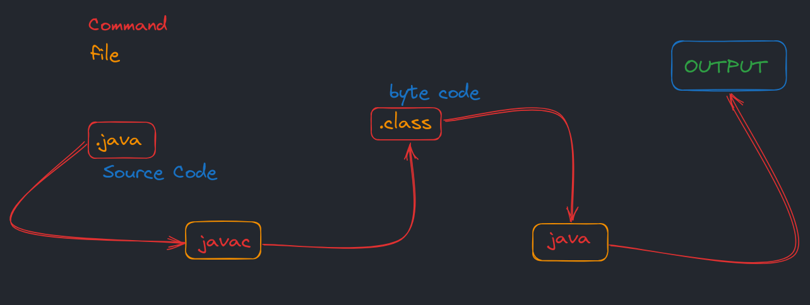

# Introduction to Java

## Description

This folder contains the foundational materials for getting started with Java programming. It includes the classic "Hello World" program, which serves as the first step in learning any programming language. This module introduces students to the basic structure of a Java program, including the main method, class declaration, and basic output operations.

The HelloWorld.java file demonstrates the essential components of a Java application: the class definition, the main method (which serves as the entry point of the program), and the System.out.println() statement for displaying output to the console.

## বিবরণ

এই ফোল্ডারটি Java প্রোগ্রামিং শেখার প্রাথমিক উপকরণসমূহ ধারণ করে। এখানে রয়েছে ক্লাসিক "Hello World" প্রোগ্রাম, যা যেকোনো প্রোগ্রামিং ভাষা শেখার প্রথম ধাপ হিসেবে কাজ করে। এই মডিউলটি শিক্ষার্থীদের Java প্রোগ্রামের মৌলিক কাঠামোর সাথে পরিচয় করায়, যার মধ্যে রয়েছে main method, class declaration, এবং basic output operations।

HelloWorld.java ফাইলটি একটি Java application-এর অপরিহার্য উপাদানসমূহ প্রদর্শন করে: class definition, main method (যা প্রোগ্রামের entry point হিসেবে কাজ করে), এবং System.out.println() statement যা console-এ output প্রদর্শনের জন্য ব্যবহৃত হয়। এই ফোল্ডারটি Java প্রোগ্রামিংয়ের ভিত্তি স্থাপন করে এবং পরবর্তী মডিউলগুলোর জন্য প্রয়োজনীয় প্রাথমিক ধারণা প্রদান করে। এখানকার কোড উদাহরণগুলি শিক্ষার্থীদের Java-এর syntax, compilation process, এবং program execution-এর সাথে পরিচিত করে তোলে।
