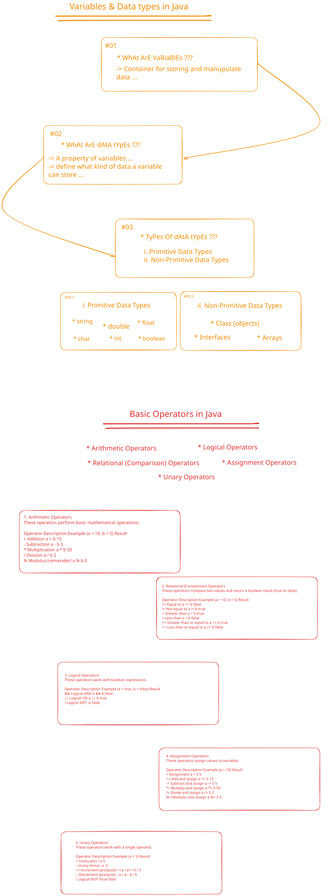

# Data Types, Variables, and Operators

## Description

This folder explores the fundamental building blocks of Java programming: data types, variables, and operators. It contains practical examples that demonstrate how to declare variables of different types, perform arithmetic operations, and manipulate data using various operators.

The FridayQA.java file illustrates variable declaration, assignment operations, and arithmetic operators through a creative scenario involving Iron Man's armor power calculations. The IronManArmorInfo.java file demonstrates the use of different primitive data types (int, float, double, char, boolean, String) to store and display various types of information.

Together, these files provide a comprehensive understanding of how data is stored, manipulated, and displayed in Java programs, covering primitive data types, variable naming conventions, and operator precedence.

## বিবরণ

এই ফোল্ডারটি Java প্রোগ্রামিংয়ের মৌলিক উপাদানসমূহ নিয়ে আলোচনা করে: data types, variables, এবং operators। এখানে বিভিন্ন ধরনের variables declare করা, arithmetic operations সম্পাদন করা, এবং বিভিন্ন operators ব্যবহার করে data manipulate করার ব্যবহারিক উদাহরণ রয়েছে।

FridayQA.java ফাইলটি variable declaration, assignment operations, এবং arithmetic operators-এর ব্যবহার Iron Man-এর armor power calculation-এর একটি সৃজনশীল scenario-এর মাধ্যমে প্রদর্শন করে। IronManArmorInfo.java ফাইলটি বিভিন্ন primitive data types (int, float, double, char, boolean, String) ব্যবহার করে বিভিন্ন ধরনের তথ্য সংরক্ষণ এবং প্রদর্শনের উদাহরণ প্রদান করে।

এই ফাইলগুলো একসাথে Java প্রোগ্রামে data কীভাবে সংরক্ষণ, পরিবর্তন, এবং প্রদর্শন করা হয় তার একটি বিস্তৃত ধারণা প্রদান করে। এখানে primitive data types, variable naming conventions, এবং operator precedence-এর বিষয়গুলো আ covered করা হয়েছে। এই মডিউলটি শিক্ষার্থীদের Java-এর data handling capabilities-এর সাথে পরিচিত করে তোলে এবং পরবর্তী মডিউলগুলোর জন্য একটি শক্ত ভিত্তি তৈরি করে।

