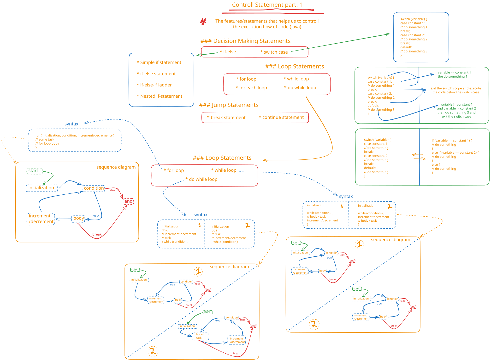

# Control Statements

## Description

This folder covers Java's control flow mechanisms, which allow programs to make decisions and execute code conditionally or repeatedly. It includes examples of conditional statements (if, if-else, if-else-if, nested if) and iterative statements (for loops, while loops), as well as pattern-based problem-solving exercises.

The IfElseDemo.java file demonstrates various conditional structures, from simple if statements to complex nested conditions. The IfElseToSwitchCase.java file shows how to convert if-else logic into switch-case statements, providing alternative approaches to decision-making. The Loop.java file contains multiple loop-based problems, including pattern printing exercises that help develop logical thinking and problem-solving skills.

These files collectively teach students how to control program execution flow, implement decision-making logic, and create repetitive operations efficiently.

## বিবরণ

এই ফোল্ডারটি Java-এর control flow mechanisms নিয়ে আলোচনা করে, যা প্রোগ্রামগুলিকে সিদ্ধান্ত নিতে এবং শর্তসাপেক্ষে বা বারবার কোড execute করতে সক্ষম করে। এখানে conditional statements (if, if-else, if-else-if, nested if) এবং iterative statements (for loops, while loops)-এর উদাহরণ রয়েছে, পাশাপাশি pattern-based problem-solving exercises-ও অন্তর্ভুক্ত রয়েছে।

IfElseDemo.java ফাইলটি বিভিন্ন conditional structures প্রদর্শন করে, simple if statements থেকে শুরু করে complex nested conditions পর্যন্ত। IfElseToSwitchCase.java ফাইলটি দেখায় কীভাবে if-else logic-কে switch-case statements-এ রূপান্তর করা যায়, যা decision-making-এর জন্য alternative approaches প্রদান করে। Loop.java ফাইলে multiple loop-based problems রয়েছে, যার মধ্যে pattern printing exercises অন্তর্ভুক্ত যা logical thinking এবং problem-solving skills বিকাশে সহায়তা করে।

এই ফাইলগুলো একসাথে শিক্ষার্থীদের শেখায় কীভাবে program execution flow নিয়ন্ত্রণ করতে হয়, decision-making logic implement করতে হয়, এবং repetitive operations efficiently তৈরি করতে হয়। এই মডিউলটি programming logic-এর একটি গুরুত্বপূর্ণ অংশ এবং এটি শিক্ষার্থীদের complex problems সমাধানের দক্ষতা বৃদ্ধি করে।

