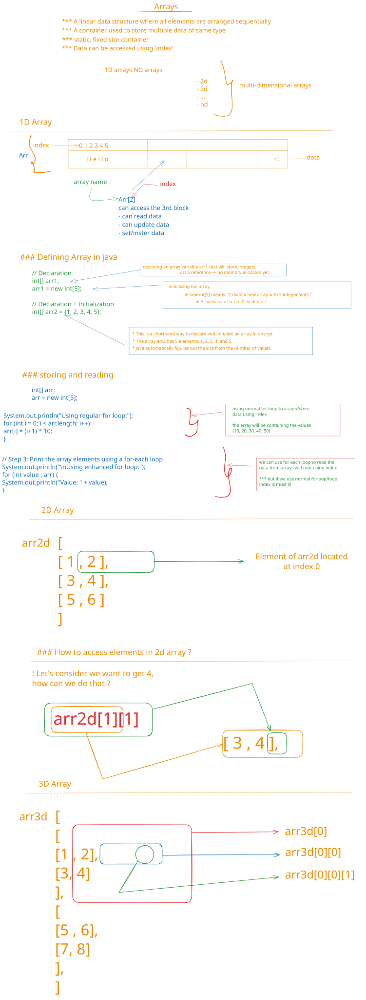

# Arrays in Java

## Description

This folder introduces arrays, which are fundamental data structures in Java used to store multiple values of the same type in a contiguous memory location. Arrays are essential for handling collections of data efficiently.

The OneD.java file demonstrates one-dimensional arrays, including array declaration, initialization, element access, iteration, and basic search algorithms like linear search. It shows how arrays are zero-indexed and how to work with array indices effectively.

The Nd.java file explores multidimensional arrays (2D and 3D arrays), illustrating how to declare, initialize, and traverse arrays with multiple dimensions. This is particularly useful for representing matrices, tables, or any structured data that requires multiple indices.

Together, these files provide a comprehensive understanding of array manipulation in Java, covering both single and multi-dimensional arrays, which are crucial for solving complex programming problems.

## বিবরণ

এই ফোল্ডারটি arrays-এর সাথে পরিচয় করায়, যা Java-তে fundamental data structures হিসেবে একই ধরনের multiple values একটি contiguous memory location-এ সংরক্ষণ করতে ব্যবহৃত হয়। Arrays data-এর collection efficiently handle করার জন্য অপরিহার্য।

OneD.java ফাইলটি one-dimensional arrays প্রদর্শন করে, যার মধ্যে রয়েছে array declaration, initialization, element access, iteration, এবং linear search-এর মতো basic search algorithms। এটি দেখায় কীভাবে arrays zero-indexed হয় এবং array indices-এর সাথে effectively কাজ করা যায়।

Nd.java ফাইলটি multidimensional arrays (2D এবং 3D arrays) নিয়ে আলোচনা করে, যা দেখায় কীভাবে multiple dimensions সহ arrays declare, initialize, এবং traverse করতে হয়। এটি matrices, tables, বা যেকোনো structured data represent করার জন্য বিশেষভাবে উপযোগী যা multiple indices প্রয়োজন।

এই ফাইলগুলো একসাথে Java-তে array manipulation-এর একটি বিস্তৃত ধারণা প্রদান করে, single এবং multi-dimensional arrays উভয়ই covering করে, যা complex programming problems সমাধানের জন্য অত্যন্ত গুরুত্বপূর্ণ। এই মডিউলটি শিক্ষার্থীদের data structures-এর সাথে পরিচিত করে তোলে এবং পরবর্তী advanced topics-এর জন্য প্রস্তুত করে।

