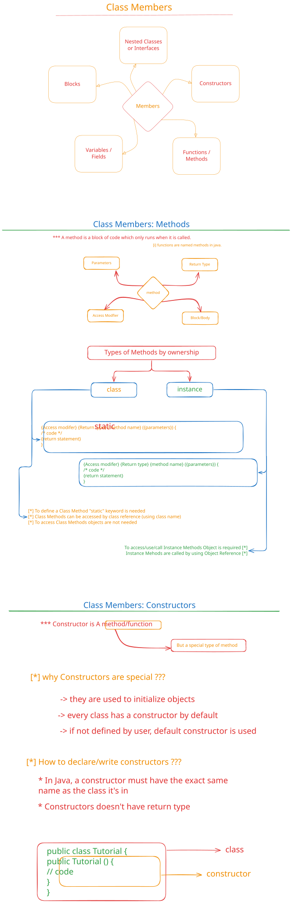

# Class Members

## Description

This folder focuses on class members in Java, which include fields (variables), methods, constructors, and nested classes that belong to a class. Understanding class members is crucial for designing well-structured, maintainable Java applications.

This module covers different types of class members, their access modifiers (public, private, protected, package-private), and how they define the behavior and state of objects. Students will learn about instance variables vs class variables (static members), instance methods vs class methods, and how these different member types affect object behavior and memory management.

The concepts in this module build upon the classes and objects foundation and prepare students for understanding encapsulation, method overloading, and other advanced OOP concepts.

## বিবরণ

এই ফোল্ডারটি Java-তে class members-এর উপর focus করে, যার মধ্যে রয়েছে fields (variables), methods, constructors, এবং nested classes যা একটি class-এর অন্তর্গত। Class members বোঝা well-structured, maintainable Java applications design করার জন্য অত্যন্ত গুরুত্বপূর্ণ।

এই মডিউলটি বিভিন্ন ধরনের class members, তাদের access modifiers (public, private, protected, package-private), এবং কীভাবে তারা objects-এর behavior এবং state define করে তা covering করে। শিক্ষার্থীরা instance variables বনাম class variables (static members), instance methods বনাম class methods সম্পর্কে শিখবে, এবং কীভাবে এই বিভিন্ন member types object behavior এবং memory management-কে প্রভাবিত করে তা বুঝবে।

এই মডিউলের concepts-গুলো classes এবং objects-এর ভিত্তির উপর নির্মিত এবং এটি শিক্ষার্থীদের encapsulation, method overloading, এবং অন্যান্য advanced OOP concepts বুঝতে প্রস্তুত করে। এই মডিউলটি Java-এর class design-এর একটি গুরুত্বপূর্ণ অংশ এবং এটি শিক্ষার্থীদের efficient এবং organized code লেখার দক্ষতা প্রদান করে।

