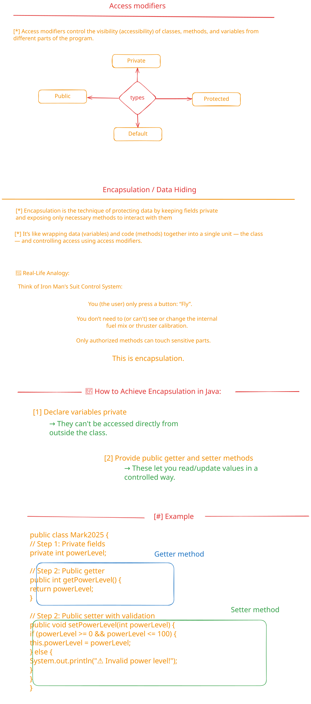

# Encapsulation and Overloading

## Description

This folder explores two important object-oriented programming concepts: encapsulation and method overloading. Encapsulation is the practice of bundling data (fields) and methods that operate on that data within a single unit (class), while controlling access through access modifiers. This helps in data hiding and maintaining code integrity.

Method overloading allows multiple methods to have the same name but different parameters, enabling more flexible and intuitive method calls. This concept demonstrates polymorphism at compile-time and provides a way to create methods that can handle different types or numbers of arguments.

Together, these concepts help students write more robust, maintainable, and user-friendly Java code by properly organizing class structure and providing multiple ways to interact with objects.

## বিবরণ

এই ফোল্ডারটি দুটি গুরুত্বপূর্ণ object-oriented programming concepts নিয়ে আলোচনা করে: encapsulation এবং method overloading। Encapsulation হল data (fields) এবং সেই data-এর উপর কাজ করা methods-কে একটি single unit (class)-এর মধ্যে bundle করার practice, যেখানে access modifiers-এর মাধ্যমে access নিয়ন্ত্রণ করা হয়। এটি data hiding এবং code integrity বজায় রাখতে সহায়তা করে।

Method overloading একই নামের multiple methods-কে allow করে কিন্তু different parameters সহ, যা আরও flexible এবং intuitive method calls-এর সুযোগ প্রদান করে। এই concept-টি compile-time-এ polymorphism প্রদর্শন করে এবং বিভিন্ন types বা numbers of arguments handle করতে পারে এমন methods তৈরি করার একটি উপায় প্রদান করে।

এই concepts-গুলো একসাথে শিক্ষার্থীদের আরও robust, maintainable, এবং user-friendly Java code লেখতে সহায়তা করে class structure properly organize করে এবং objects-এর সাথে interact করার multiple ways প্রদান করে। এই মডিউলটি Java-এর advanced OOP features-এর একটি গুরুত্বপূর্ণ অংশ এবং এটি শিক্ষার্থীদের professional-level programming skills বিকাশে সহায়তা করে।

